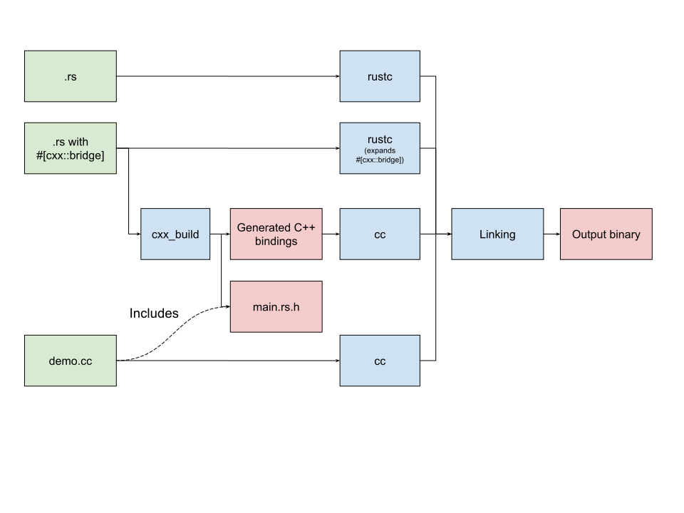

# Building mixed codebases

Intrinsically, `cxx` requires a binary which contains both Rust and C++ code (the same applies to `bindgen` and `cbindgen` of course). Both Rust and C++ code are automatically generated from your `#[cxx::bridge]` module, and you'll have additional Rust and C++ code beyond that.

You'll need to achieve three things:

* Generate the cxx C++ bindings code.
* Compile the C++ code.
* Link the resulting binaries.

The overall process is shown here:

## Generating the cxx C++ code

The Rust code is automatically generated by expanding the `#[cxx::bridge]` procedural macro during the normal Rust compilation process, so no special build steps are required there.

But the C++ side of the bindings needs to be generated. Your options are:

* Use a `build.rs` that utilizes the [cxx_build](https://docs.rs/cxx-build) instructions. This is most appropriate for simple projects such as the [tutorial](tutorial.md).
* Use the `cxxbridge` command, and invoke it from some external build system. More details are [described here](https://docs.rs/cxx-build/0.4.7/cxx_build/#alternatives).
* Build your own code generator using the [cxx_gen](https://docs.rs/cxx-gen/0.4.1) crate. This is currently unofficial and unsupported.

 (To avoid deep confusion later, try to set up dependency rules such that the C++ bindings are regenerated whenever the `#[cxx::bridge]` code changes.)

## Compiling C++

For a simple demo project, the [cxx_build](https://docs.rs/cxx-build) crate takes care of compiling the code by using the `cc` crate (and you can extend it to build additional C++ files, as we do in the [tutorial](tutorial.md)).

But in any complex codebase, you're bound to have your own C++ build system, so build the code however you like!

## Linking the C++ and Rust together

When linking a binary which contains mixed Rust and C++ code, you will have to choose between using the Rust toolchain (`cargo`, `rustc`) or the C++ toolchain (which you may already have extensively tuned).

Rust does not generate simple standalone `.o` files, so you can't just throw the Rust-generated code into your existing C++ toolchain linker. Instead, you must choose one or other of these options:

* Use `rustc` as the final linker. Pass any non-Rust libraries using `-L <directory>` and `-l<library>` rustc arguments, and/or `#[link]` directives in your Rust code. If you need to link against C/C++ `.o` files you can use `-Clink-arg=file.o`. (You can of course use `cargo` to invoke `rustc`).
* Use your C++ linker. In this case, you first need to use `rustc`/`cargo` to generate a _single_ Rust `staticlib` target and pass that into your foreign linker invocation.
  * If you need to link multiple Rust subsystems, you will need to generate a _single_ `staticlib` perhaps using lots of `extern crate` statements to include multiple Rust `rlib`s.  Multiple Rust `staticlib` files are likely to conflict.

Passing `rlib`s directly into your foreign linker is not supported.

See the [Rust reference linkage](https://doc.rust-lang.org/reference/linkage.html) page for some general information here.