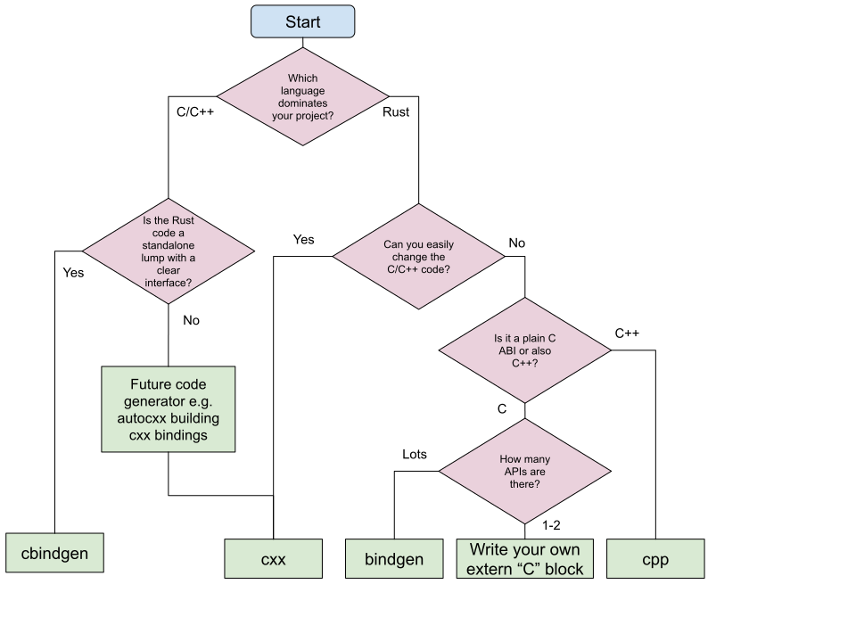

# Context - other Rust and C++ interoperability tools

Other fine C++/Rust interop projects exist. Here are your options for Rust/C++ interop, and how `cxx` fits in.

* Write raw bindings yourself using `extern "C"` and `#[no_mangle]` to call C functions directly, going down to a C lowest common denominator on both sides.
* [bindgen](https://docs.rs/bindgen/) - generates Rust bindings from C/C++ headers.
* [cbindgen](https://docs.rs/cbindgen/) - generates C/C++ bindings from Rust code.
* [cpp](https://docs.rs/cpp) - allows inline C++ code within Rust code.
* This current crate, `cxx`
* In the future, there may be higher level code generators on top of `cxx` (there is an early such attempt at [autocxx](http://docs.rs/autocxx). `autocxx` plugs `bindgen` into `cxx`.

Which should you use? Here are some heuristics.

| Scenario | Suggestion |
| -------- | ---------- |
| My project is mostly Rust, but needs to call some _existing_ C code which is hard for me to change. | If you're calling into one or two existing C APIs, write the bindings yourself. `extern "C"` and `#[no_mangle]` is sufficient. If you're calling into more than one or two existing C APIs, or passing any structs, use `bindgen` to generate those Rust bindings automatically. |
| My project is mostly Rust, but needs to call some existing C++ code which is hard for me to change | Use `cpp` for inline C++ calls |
| My project is mostly C/C++. I want to call a standalone discrete lump of Rust code | Use `cbindgen` to create C/C++ bindings to that Rust code |
| My project is mixed C++ and Rust. I control both sides | Use `cxx` to manually write _safe_ bindings to call backwards and forwards |
| My project is mostly C++ with a bit of Rust. I control both sides, but the Rust code needs to call dozens of existing C++ APIs | Use `autocxx` or some future high-level code generator on top of `cxx` to generate the safe bindings automatically |

Something like this sort of decision tree:

Or use a mixture! In particular, see [the chapter on C++ types](cpp-types.md) for how `cxx` can be used together with `bindgen`.